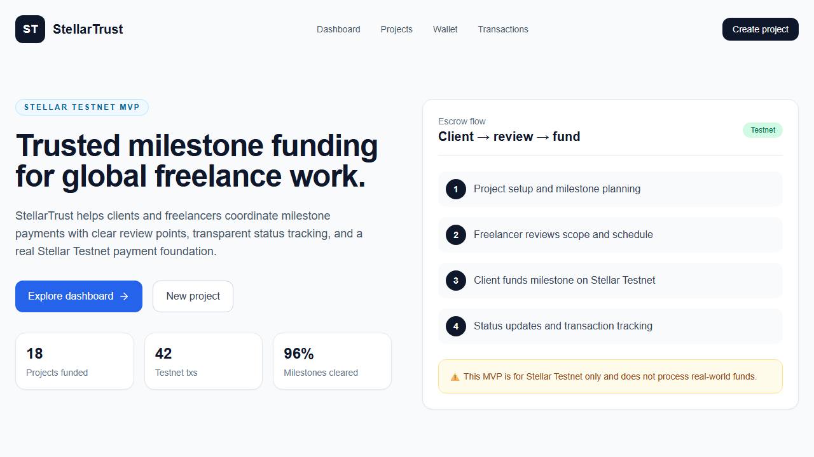
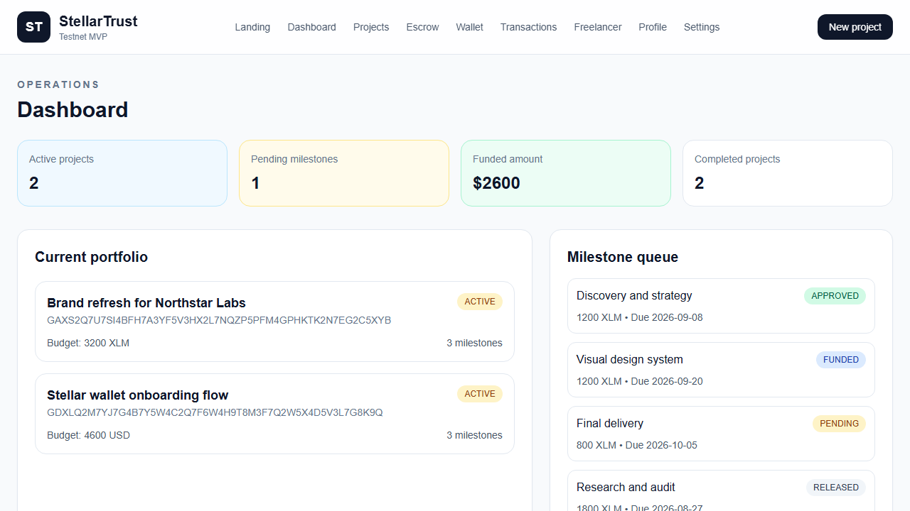
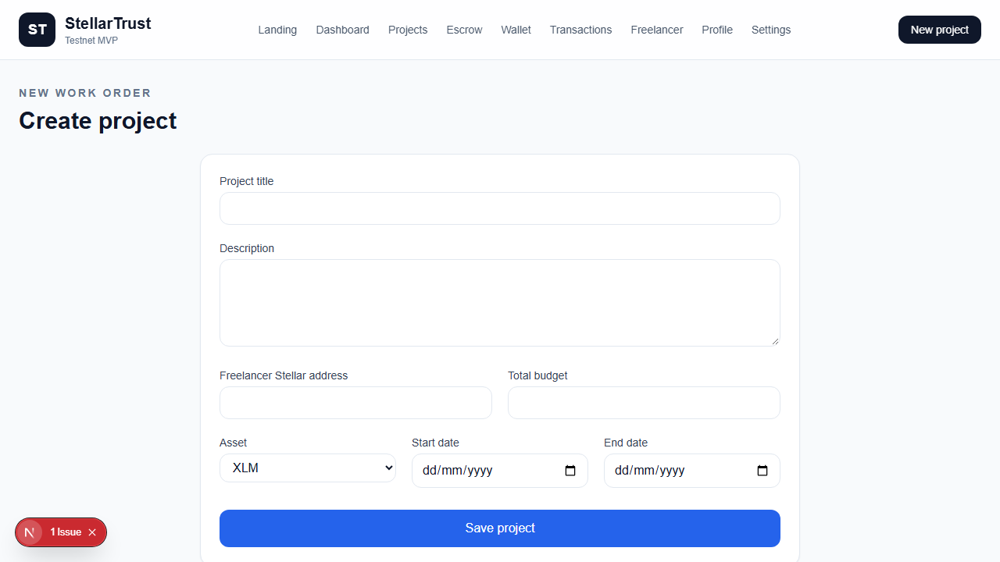
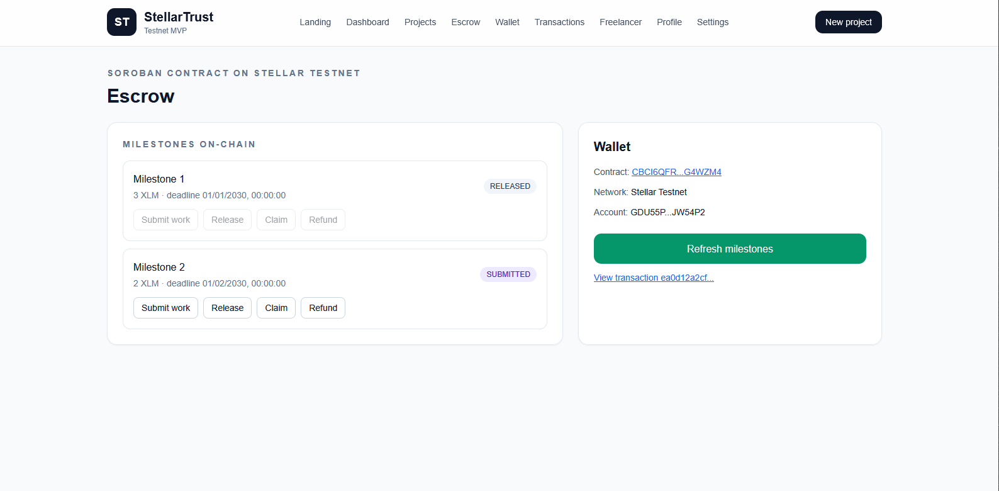

# StellarTrust

StellarTrust is a milestone-based escrow MVP for freelancers and clients built on Stellar Testnet. It demonstrates how milestone funding, project tracking, and transaction visibility can be coordinated with an application-controlled workflow while keeping Stellar transaction logic isolated in a dedicated service layer.

This project is currently a Stellar Testnet MVP and does not process real-world funds.

**Live Soroban escrow contract (Testnet):** [`CB3HIJKAE23437S4MGSYAIYXQDLN73J56KNME5WNCY2KRKYCMTMZJHIV`](https://stellar.expert/explorer/testnet/contract/CB3HIJKAE23437S4MGSYAIYXQDLN73J56KNME5WNCY2KRKYCMTMZJHIV) - see [docs/soroban-escrow.md](docs/soroban-escrow.md).

## Overview

StellarTrust helps clients and freelancers coordinate trust around milestone-based work. Instead of a full decentralized arbitration stack, the MVP focuses on the essential flow:

- a client creates a project and defines milestones
- a freelancer views milestone requirements
- the client funds a milestone on Stellar Testnet
- the application tracks milestone state and transaction details
- the freelancer can review the milestone and project context
    

Cross-border freelance work often requires trust around payment timing, amount verification, and milestone completion. Without a clear payment structure, both sides are exposed to delays, disputes, and unclear obligations.

## Solution

StellarTrust provides an application-friendly milestone escrow workflow that is intentionally simple and transparent:

- milestone-based project setup
- budget and asset tracking
- Stellar Testnet payment foundation for destination validation and transaction construction
- transaction lookup and receipt details
- clear separation between application state and blockchain operations

## Why Stellar

Stellar was chosen because it provides:

- fast settlement on a public network
- low-friction Testnet experimentation
- simple payment primitives suitable for an escrow-style MVP
- a familiar Horizon API for account and transaction lookups

## How It Works

1. The client creates a project and defines milestone amounts.
2. The freelancer reviews project milestones and status.
3. The client reviews a milestone and confirms funding.
4. The application validates the destination wallet, checks balances, and builds a Stellar payment transaction.
5. The transaction is signed and submitted to Horizon Testnet.
6. The UI updates milestone state and displays transaction metadata.

## MVP Features

Implemented:

- landing page
- dashboard with demo state and real Stellar-aware UI boundaries
- project creation form with validation
- project detail pages
- milestone creation and status tracking
- wallet page for public address and balance lookup
- real Stellar Testnet payment service
- transaction detail and explorer link support
- freelancer milestone overview
- docs and future work planning

Planned:

- authentication and persistent sessions
- persistent project ownership and authorization
- full PostgreSQL persistence for projects
- persistent milestone state
- production-grade escrow contract
- Soroban smart-contract escrow
- automated milestone release
- full dispute resolution system
- notifications
- freelancer withdrawal and earnings system
- mainnet support
- comprehensive integration testing

## Architecture

The project uses a small monorepo:

- web app for product UI and flows
- API for REST endpoints and application state
- shared package for Stellar logic
- validation package for domain checks
- types package for shared interfaces
- Prisma schema foundation for future persistence modeling

## Stellar Integration

This MVP uses a dedicated package for Stellar logic, keeping transaction operations out of React components.

Required environment values are in `.env.example` and default to the Testnet network.

The implementation includes:

- address validation
- source account lookup
- balance lookup
- payment transaction construction
- signing and submission when configured
- transaction lookup by hash

## Tech Stack

- Next.js
- TypeScript
- Tailwind CSS
- shadcn/ui-inspired UI primitives
- Express REST API
- Prisma schema foundation
- Stellar SDK
- Horizon Testnet
- Vitest for unit scaffolding

## Project Structure

```text
stellar-trust/
├── apps/
│   ├── api/
│   └── web/
├── packages/
│   ├── database/
│   ├── stellar/
│   ├── types/
│   └── validation/
├── prisma/
├── docs/
├── tests/
├── .github/
├── .env.example
├── .gitignore
├── README.md
├── ROADMAP.md
├── SECURITY.md
├── CONTRIBUTING.md
├── CODE_OF_CONDUCT.md
├── LICENSE
└── package.json
```

## UI Preview

### Homepage



### Dashboard



### Project creation



### Live on-chain escrow

Milestones read from a Soroban escrow contract on Testnet, with Freighter signing (screenshot taken against the first deployment). Milestone 1 has been released; milestone 2 is submitted.



## Local Development

```bash
npm install
npm run dev
```

Then open the web app at http://localhost:3000 and the API at http://localhost:4001.

## Environment Variables

Copy `.env.example` to `.env` and fill in your Stellar Testnet configuration.

Required values:

```bash
STELLAR_NETWORK=testnet
STELLAR_HORIZON_URL=https://horizon-testnet.stellar.org
STELLAR_SOURCE_PUBLIC_KEY=
STELLAR_SOURCE_SECRET=
NEXT_PUBLIC_APP_URL=http://localhost:3000
API_BASE_URL=http://localhost:4001
NEXT_PUBLIC_STELLAR_EXPLORER=https://testnet.stellar.org/explorer/testnet/tx/
```

## Stellar Testnet Setup

- use Stellar Testnet network only
- do not place real funds in the project
- keep private keys out of frontend storage
- use valid Horizon Testnet endpoints only

## Testing

The project includes unit scaffolding for validation and Stellar service behavior. It does not claim comprehensive blockchain integration coverage.

```bash
npm test
```

## Security

- validate all required user inputs
- validate Stellar public keys before payment submission
- never expose secret keys in the frontend
- use environment variables for network configuration
- keep the Testnet-only warning visible throughout the product

## Roadmap

See [ROADMAP.md](ROADMAP.md) for planned milestones and contribution priorities.

## Contributing

Please read [CONTRIBUTING.md](CONTRIBUTING.md) before submitting pull requests.

## License

This project is licensed under the MIT License; see [LICENSE](LICENSE).
